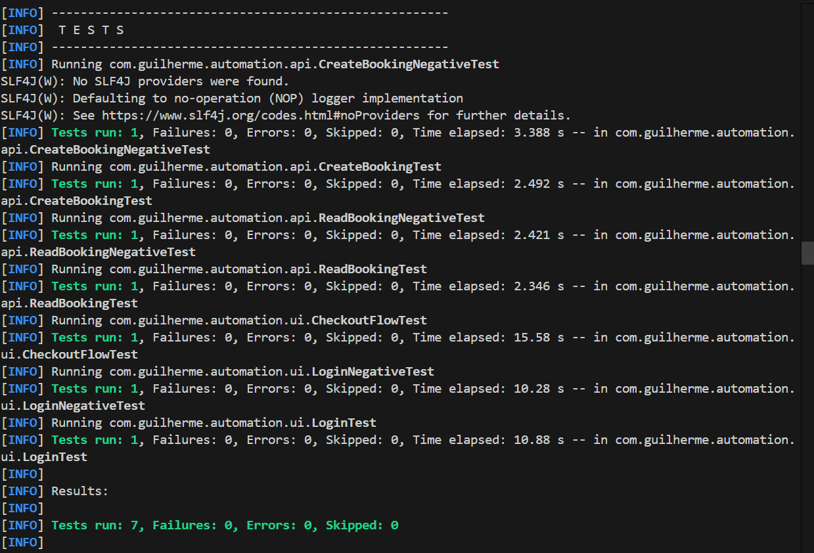

# 🚀 Desafio Prático – Automação de Testes

Projeto desenvolvido como parte de um desafio técnico com foco em:

- Planejamento de cenários
- Estruturação de casos de teste
- Automação de testes de API e Interface
- Aplicação de boas práticas (Page Object, organização e reutilização)

---

# 🛠 Ferramentas Utilizadas

## 🔹 Linguagem
- Java 17+

## 🔹 Build
- Maven

## 🔹 Testes de API
- RestAssured
- JUnit 5

## 🔹 Testes de Interface (UI)
- Selenium WebDriver
- Firefox
- WebDriverManager
- JUnit 5
- Page Object Pattern

## 🔹 Controle de Versão
- Git
- GitHub

---

# ▶️ Como Executar os Testes

## 📌 Pré-requisitos

- Java instalado (versão 17+)
- Maven instalado
- Firefox instalado

---

## 🔹 Executar todos os testes

```bash
mvn clean test
```

---

# 📸 Evidência de Execução

### Execução via Maven


### Relatório HTML (Surefire)
[Abrir relatório HTML](evidences/surefire-report.html)

---

# 📂 Estrutura do Projeto

src
 └── test
      └── java
           └── com.guilherme.automation
                ├── api        → Testes de API (RestAssured)
                ├── ui         → Testes de Interface (JUnit)
                ├── pages      → Page Objects (UI)
                ├── base       → BaseTest e BasePage
                └── utils      → Configurações centralizadas

## 🔹 BaseTest
- Responsável por inicializar e finalizar o WebDriver.

## 🔹 BasePage
- Contém métodos reutilizáveis:
    - Esperas explícitas (WebDriverWait)
    - click()
    - type()
    - text()

## 🔹 Pages
- Cada página do sistema possui sua própria classe seguindo o padrão Page Object.

## 🔹 API
- Testes organizados por operação (Create, Read, etc).

---

# 🎯 Estratégia Adotada

## 📌 Planejamento

- Foram planejados:
    - 8 cenários de API (CRUD completo + negativos)
    - 3 cenários de Interface (Login e Fluxo de Compra)

- Os cenários foram estruturados em planilha contendo:
    - Identificação
    - Tipo
    - Prioridade
    - Possibilidade de automação
    - Justificativa

## 📌 Priorização da Automação

- Embora tenham sido planejados 8 cenários de API, foram automatizados:
    - CREATE (positivo e negativo)
    - READ (positivo e negativo)

- Os cenários de UPDATE e DELETE autenticados foram planejados, porém não automatizados devido à instabilidade da API pública utilizada (ambiente compartilhado e tokens voláteis), priorizando estabilidade e confiabilidade da suíte.

- Para UI foram automatizados:
    - Login válido
    - Login inválido
    - Fluxo completo de compra

- Totalizando 7 testes automatizados.

## 📌 Boas Práticas Aplicadas
- Page Object Pattern
- Separação por camadas (Base, Pages, Tests)
- Centralização de configurações
- Reutilização de código
- Esperas explícitas (WebDriverWait)
- Estrutura organizada e escalável

## ✅ Resultados
- Testes executando com sucesso
- Projeto organizado
- Cobertura de cenários positivos e negativos

---

# 👤 Autor

Guilherme Hirata